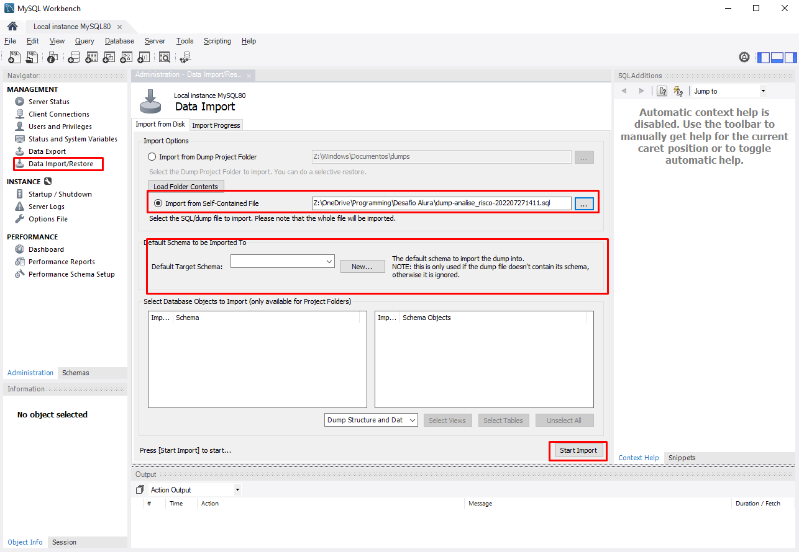

## Desafio Alura

Você foi contratado(a) como pessoa cientista de dados para trabalhar em um banco digital internacional chamado Alura Cash. Na primeira reunião do seu novo trabalho, a diretoria financeira informa que, recorrentemente, estão surgindo pessoas inadimplentes após a liberação de créditos. Portanto, é solicitada uma solução para que seja possível diminuir as perdas financeiras por conta de pessoas mutuarias que não quitam suas dívidas.

Como cientista de dados, você sugere um estudo das informações financeiras e de solicitação de empréstimo para encontrar padrões que possam indicar uma possível inadimplência.

Desse modo, você solicita um conjunto de dados que contenha as informações de clientes, da solicitação de empréstimo, do histórico de crédito, bem como se a pessoa mutuaria é inadimplente ou não. Com esses dados, você sabe que consegue modelar um classificador capaz de encontrar potenciais clientes inadimplentes e solucionar o problema do Alura Cash.

Por fim, você vai utilizar o GitHub e desenvolver um portfólio focado em Data Science, Data Analytics e Machine Learning.

Link do repositório: [https://github.com/Mirlaa/Challenge-Data-Science-1ed](https://github.com/Mirlaa/Challenge-Data-Science-1ed)

### Notebooks:
- [Semana 1](https://github.com/PericlesSavio/Jupyter_Notebook/blob/main/Desafio%20Alura/semana_1.ipynb)
- [Semana 2](https://github.com/PericlesSavio/Jupyter_Notebook/blob/main/Desafio%20Alura/semana_2.ipynb)

### Atividades (Semana 1)
- [ ] Instalar MySQL Workbench e importar **database dump**.
- [ ] Analisar quais os tipos de dados.
- [ ] Entender quais informações o conjunto de dados possui.
- [ ] Verificar quais são as inconsistências nos dados.
- [ ] Corrigir as inconsistências nos dados.
- [ ] Unir as tabelas de dados de acordo com os IDs.
- [ ] Traduzir as colunas.
- [ ] Exportar a tabela de dados unidos como csv.

#### Instalar MySQL Workbench e importar **database dump**

- [x] Instalar MySQL Workbench e importar **database dump**.

#### Traduzir os dados

Uma das atividade é traduzir os dados. Com auxílio do dicionário de dados **[https://github.com/Mirlaa/Challenge-Data-Science-1ed/tree/main/Dados](https://github.com/Mirlaa/Challenge-Data-Science-1ed/tree/main/Dados)** os dados foram traduzidos utilizando o código abaixo.

``` sql
-- aluracash.dados_mutuarios

ALTER TABLE aluracash.dados_mutuarios
RENAME COLUMN person_id TO PESSOA,
RENAME COLUMN person_age TO IDADE,
RENAME COLUMN person_income TO RENDIMENTO_ANUAL,
RENAME COLUMN person_home_ownership TO SITUACAO_PROPRIEDADE,
RENAME COLUMN person_emp_length TO ANOS_TRABALHADOS;

ALTER TABLE aluracash.dados_mutuarios
MODIFY COLUMN SITUACAO_PROPRIEDADE VARCHAR(10); -- Error Code: 1406. Data too long for column 'SITUACAO_PROPRIEDADE' at row 4. A palavra 'Hipotecada' tem 10 caracteres.

SET SQL_SAFE_UPDATES = 0; -- Error Code: 1175. You are using safe update mode and you tried to update a table without a WHERE that uses a KEY column.  To disable safe mode, toggle the option in Preferences -> SQL Editor and reconnect.

UPDATE aluracash.dados_mutuarios
SET SITUACAO_PROPRIEDADE  =
    CASE
        WHEN SITUACAO_PROPRIEDADE = 'Rent' THEN 'Alugada'
        WHEN SITUACAO_PROPRIEDADE = 'Own' THEN 'Própria'
        WHEN SITUACAO_PROPRIEDADE = 'Mortgage' THEN 'Hipotecada'
        WHEN SITUACAO_PROPRIEDADE = 'Other' THEN 'Outros'
    END;


-- aluracash.emprestimos

ALTER TABLE aluracash.emprestimos
RENAME COLUMN loan_id TO EMPRESTIMO,
RENAME COLUMN loan_intent TO MOTIVO_EMPRESTIMO,
RENAME COLUMN loan_grade TO PONTUACAO,
RENAME COLUMN loan_amnt TO VALOR_EMPRESTIMO,
RENAME COLUMN loan_int_rate TO JUROS,
RENAME COLUMN loan_status TO POSSIB_INADIMPLENCIA,
RENAME COLUMN loan_percent_income TO EMPRESTIMO_PERC_RENDA_ANUAL;

ALTER TABLE aluracash.emprestimos
MODIFY COLUMN MOTIVO_EMPRESTIMO VARCHAR(20); -- Error Code: 1406.

UPDATE aluracash.emprestimos
SET MOTIVO_EMPRESTIMO  =
CASE
    WHEN MOTIVO_EMPRESTIMO = 'Homeimprovement' THEN 'Melhora do lar'
    WHEN MOTIVO_EMPRESTIMO = 'Venture'    THEN 'Empreendimento'
    WHEN MOTIVO_EMPRESTIMO = 'Personal'THEN 'Pessoal'
    WHEN MOTIVO_EMPRESTIMO = 'Medical'THEN 'Médico'
    WHEN MOTIVO_EMPRESTIMO = 'Education'THEN'Educativo'
    WHEN MOTIVO_EMPRESTIMO = 'Debtconsolidation'THEN 'Pagamento de débitos'
END;


-- aluracash.historicos_banco

ALTER TABLE aluracash.historicos_banco
RENAME COLUMN cb_id TO SOLICITACAO,
RENAME COLUMN cb_person_default_on_file TO INADIMPLENTE,
RENAME COLUMN cb_person_cred_hist_length TO ANOS_PRIMEIRO_CREDITO;

UPDATE aluracash.historicos_banco
SET INADIMPLENTE  =
CASE
    WHEN INADIMPLENTE = 'N' THEN 0
    WHEN INADIMPLENTE = 'Y' THEN 1
END;

ALTER TABLE aluracash.historicos_banco
MODIFY COLUMN INADIMPLENTE INT; -- Adequar o tipo do dado (de VARCHAR(1) para INT)
```
- [x] Traduzir as colunas.

#### Analisar quais os tipos de dados

Executar uma liha de cada vez:
```sql
SHOW COLUMNS FROM id;
SHOW COLUMNS FROM dados_mutuarios;
SHOW COLUMNS FROM emprestimos;
SHOW COLUMNS FROM historicos_banco;
```

As tabelas possuem dados do tipo **INT**, **FLOAT** e **VARCHAR**.
- [x] Analisar quais os tipos de dados.

#### Entender quais informações o conjunto de dados possui.

As tabelas **dados_mutuarios**, **emprestimos**, **historicos_banco** possui dados acerca de perdas financeiras geradas por pessoas mutuárias que não quitam suas dívidas, além de informações pessoais como idade, situação da propriedade e outros.

A tabela **id** possui IDs para relacionamento com outras tabelas.
- [x] Entender quais informações o conjunto de dados possui.


#### Verificar as inconsistências nos dados

Para verificar valores vazio ou nulos:


SELECT nome_coluna FROM nome_tabela
WHERE nome_coluna IS NULL OR nome_coluna = ''


Exemplo:
``` sql
SELECT * FROM aluracash.emprestimos
WHERE JUROS IS NULL OR JUROS = ''
```

A tabela **id** é única que não apresenta valores nulos, vazios nem duplicados.
- [x] Verificar quais são as inconsistências nos dados.

#### Unir as tabelas de dados de acordo com os IDs

Para agilizar o processo, estas duas estapas foram feitas juntas.

Para juntar as tabelas foi utilizado **INNER JOIN**, os dados das tabelas que não se ralacionam com a tabela **id** foram desconsiderados.

```sql
SELECT PESSOA, IDADE, RENDIMENTO_ANUAL, SITUACAO_PROPRIEDADE, ANOS_TRABALHADOS, EMPRESTIMO, MOTIVO_EMPRESTIMO, PONTUACAO, VALOR_EMPRESTIMO, JUROS, POSSIB_INADIMPLENCIA, EMPRESTIMO_PERC_RENDA_ANUAL, SOLICITACAO, INADIMPLENTE, ANOS_PRIMEIRO_CREDITO
FROM id
INNER JOIN dados_mutuarios
on id.person_id = dados_mutuarios.PESSOA
INNER JOIN emprestimos
on id.loan_id = emprestimos.EMPRESTIMO
INNER JOIN historicos_banco
on id.cb_id = historicos_banco.SOLICITACAO
```

O resultado é uma tabela com 15 colunas e 14.952 linhas.
- [x] Unir as tabelas de dados de acordo com os IDs.

#### Corrigir as inconsistências nos dados

Foram encontradas linhas com o id **PESSOA** vazios, essas linhas foram removidas.

```sql
SELECT PESSOA, IDADE, RENDIMENTO_ANUAL, SITUACAO_PROPRIEDADE, ANOS_TRABALHADOS, EMPRESTIMO, MOTIVO_EMPRESTIMO, PONTUACAO, VALOR_EMPRESTIMO, JUROS, POSSIB_INADIMPLENCIA, EMPRESTIMO_PERC_RENDA_ANUAL, SOLICITACAO, INADIMPLENTE, ANOS_PRIMEIRO_CREDITO
FROM id
INNER JOIN dados_mutuarios
on id.person_id = dados_mutuarios.PESSOA
INNER JOIN emprestimos
on id.loan_id = emprestimos.EMPRESTIMO
INNER JOIN historicos_banco
on id.cb_id = historicos_banco.SOLICITACAO
AND PESSOA != ''
```

O resultado é uma tabela com 15 colunas e 34.485 linhas.
- [x] Corrigir as inconsistências nos dados.


#### Exportar a tabela de dados unidos como csv
Para exportar foi utilizado o Python.
Link do Jupyter Notebook: [semana_1.ipynb](https://github.com/PericlesSavio/Alura_Challenge_Data_Science-2022/blob/master/semana_1.ipynb)

```python
# bibliotecas usadas:
import mysql.connector as sql # fazer a conexão com o MySQL
import pandas as pd # manipulação dos dados

# opcional (ocutar alguns alertas)
import warnings
warnings.filterwarnings('ignore')

# conexão
db_connection = sql.connect(host='127.0.0.1', database='aluracash', user='root', password='senha123')

# testar conexao
pd.read_sql('SELECT * FROM id', con=db_connection)

# query unindo todas as tabelas
tabela_aluracash = pd.read_sql(
"""SELECT PESSOA, IDADE, RENDIMENTO_ANUAL, SITUACAO_PROPRIEDADE, ANOS_TRABALHADOS, EMPRESTIMO, MOTIVO_EMPRESTIMO, PONTUACAO, VALOR_EMPRESTIMO, JUROS, POSSIB_INADIMPLENCIA, EMPRESTIMO_PERC_RENDA_ANUAL, SOLICITACAO, INADIMPLENTE, ANOS_PRIMEIRO_CREDITO
FROM id
INNER JOIN dados_mutuarios
on id.person_id = dados_mutuarios.PESSOA
INNER JOIN emprestimos
on id.loan_id = emprestimos.EMPRESTIMO
INNER JOIN historicos_banco
on id.cb_id = historicos_banco.SOLICITACAO
AND PESSOA != ''""", con=db_connection)

# exportar para formato CSV
tabela_aluracash.to_csv(('tabela_aluracash.csv'), sep=';', index=False)
```
- [x] Exportar a tabela de dados unidos como csv.

### Atividades (Semana 1)
- [x] Instalar MySQL Workbench e importar **database dump**.
- [x] Analisar quais os tipos de dados.
- [x] Entender quais informações o conjunto de dados possui.
- [x] Verificar quais são as inconsistências nos dados.
- [x] Corrigir as inconsistências nos dados.
- [x] Unir as tabelas de dados de acordo com os IDs.
- [x] Traduzir as colunas.
- [x] Exportar a tabela de dados unidos como csv.

### Atividades (Semana 2)
- [X] Remoção de dados nulos.
- [X] Tratamento de outliers.
- [X] Analisar a correlação das variáveis.
- [X] Aplicar encoding nas variáveis categóricas.
- [X] Normalização das variáveis.
- [X] Balanceamento na variável alvo.
- [X] Avaliação dos modelos.
- [ ] Otimização de hiperparâmetros.
- [ ] Exportação do modelo.

### Notebooks:
[Semana 1](https://github.com/PericlesSavio/Jupyter_Notebook/blob/main/Desafio%20Alura/semana_1.ipynb)
[Semana 2](https://github.com/PericlesSavio/Jupyter_Notebook/blob/main/Desafio%20Alura/semana_2.ipynb)
