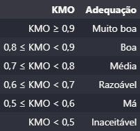

## Análise de Componentes Principais (PCA ou Principal Component Analysis)

A análise de componentes principais (PCA) é uma técnica para reduzir a dimensionalidade de tais conjuntos de dados, aumentando a interpretabilidade, mas ao mesmo tempo minimizando a perda de informações. Ela faz isso criando novas variáveis não correlacionadas que maximizam sucessivamente a variância. 

PCA lida lida com variáveis **métricas** que possuem, entre si, consideráveis valores de correlação, a fim de se estabelecer nova(s) variável(is) que capture(m) o comportamento conjunto das variáveis originais. Essas variáveis têm o nome de **Fator**.


#### Requisitos para usar PCA
* Variáveis métricas
* Variáveis com alto grau de correlação.

#### Objetivo
* Reduzir a dimensionalidade da base de dados
* Evidenciar variáveis ortogonais entre si;
* Validar constructos
* Elaborar rankings sem a utilização da ponderação arbitrária.


#### Algumas bibliotecas

```python
# teste de Bartlett
from scipy.stats import bartlett 
from factor_analyzer.factor_analyzer import calculate_bartlett_sphericity

# teste de Kaiser-Meyer-Olkin (KMO)
from factor_analyzer.factor_analyzer import calculate_kmo

# obtendo os Eigenvalues (autovalores)
from factor_analyzer import FactorAnalyzer
```


##### Etapas
* Teste da esfericidade de Bartlett
* Teste de Kaiser-Meyer-Olkin
* Matriz de correlação
* Calcular os Autovalores e Autovetores
* Definir a quantidade de Fatores
* Calcular os Scores Fatoriais
* Calcular as cargas fatoriais e a comunalidade


### Conceitos
- **Comunalidade**: representa a variância total compartilhada da cada uma das variáveis originais com todos os fatores extraídos. Ou seja, o que é comum de cada variável nos fatores. Pode ser interpretada como a confiabilidade do indicador no contexto dos fatores que estão sendo postulados. Busca-se Desejamos comunalidades superiores a 0,5.

- **Cargas fatoriais**: correlações entre os Fatores e as variáveis originais da base de dados.

- **Teste da esfericidade de Bartlett**: teste para verificar se devemos rejeitar a hipótese de que a matriz de correlação de uma base de dados é igual a uma matriz identidade. Se rejeitarmos (p-value < nível de significância), podemos utilizar a PCA para redução de dimensionalidade.

- **Autovalores**: mostram quantas variáveis cada autovalor representa em termos de variância. Quando dividimos os Autovalores pelo número de variáveis na base de dados, conseguimos entender a variância explicada que cada fator terá sobre a variância total das variáveis originais.

- **Autovetores**: projeções das variâncias capturadas das variáveis originais. Ele vai mostrar o quanto cada fator está capturando da variância de cada variável.

- **Método de Keiser**: Para definir quantos fatores serão utilizados no modelo, utiliza-se apenas aqueles com os autovalores mais que 1.

- **Teste de Kaiser-Meyer-Olkin (KMO)**: é um critério para identificar se um modelo de análise fatorial que está sendo utilizado é adequadamente ajustado aos dados, testando a consistência geral dos dados. Este método verifica se a matriz de correlação inversa é próxima da matriz diagonal, consistindo em comparar os valores dos coeficientes de correlação linear observados com os valores dos coeficientes de correlação parcial.




#### Referências

- https://royalsocietypublishing.org/doi/10.1098/rsta.2015.0202

- https://medium.com/@felipeverasaraujo/abrindo-a-caixa-preta-pca-an%C3%A1lise-de-componentes-principais-d5d400781dfe

- https://acervolima.com/analise-de-componentes-principais-com-python/

- https://phylos.net/2020-11-02/analise-fatorial-usando-python

- https://repositorio.enap.gov.br/bitstream/1/4790/1/Livro%20An%C3%A1lise%20Fatorial.pdf

- https://edisciplinas.usp.br/pluginfile.php/3381454/mod_resource/content/1/Resumo_PCA_FA.pdf

- https://www.ibm.com/docs/pt-br/spss-statistics/29.0.0?topic=detection-kmo-bartletts-test

- https://medium.com/@felipeverasaraujo/abrindo-a-caixa-preta-pca-an%C3%A1lise-de-componentes-principais-d5d400781dfe

- https://rstudio-pubs-static.s3.amazonaws.com/72772_9e20e1d9d3624aa08a498cd62f78cdca.html

- https://willstenico.medium.com/puffindex-criando-um-ranking-de-a%C3%A7%C3%B5es-brasileiras-utilizando-pca-analise-de-componentes-2715f2ffc46a