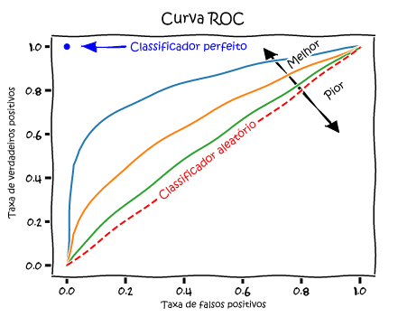

# Regressão Logística

A regressão logística é um método estatístico utilizado para modelar e prever a probabilidade de ocorrência de um evento binário, ou seja, quando existem apenas dois resultados possíveis. É usado para modelar relacionamentos entre uma variável dependente $y$ e uma ou mais variáveis independentes ($x1$, $x2$, $x3$, ...). Usa a função logística (também chamada de função sigmoide) para modelar uma variável dependente binária. A função logística é uma curva em forma de S que mapeia qualquer valor de entrada para um valor entre $0$ e $1$. Isso permite que o modelo de regressão logística preveja a probabilidade de ocorrência do evento binário.

A equação geral da regressão logística é dada por:

$$p(y=1|x) = 1 / (1 + e^(-x))$$

Exemplo do gráfico:
 versus horas de estudo (variável independente escalar).")

### Conceitos
##### Logit
Logit é a transformação logarítmica da razão entre a probabilidade de sucesso e a probabilidade de falha em um experimento binomial, geralmente utilizada em análises de regressão logística. A transformação logito é dada pela fórmula:

$$logit = ln(p/(1-p))$$

onde p é a probabilidade de sucesso e ln é a função logarítmica natural. O logit é utilizado para transformar a relação não linear entre a variável resposta e as variáveis explicativas em uma rela

##### Acurácia
A acurácia (ou eficiência global do modelo) é uma medida de desempenho de um modelo ou classificador que indica a proporção de observações classificadas corretamente em relação ao total de observações.

##### Sensitividade
Sensitividade (ou recall), também conhecida como taxa de verdadeiros positivos (TPR - True Positive Rate), é uma medida que indica a proporção de casos positivos corretamente identificados pelo modelo em relação ao total de casos positivos presentes na amostra.

$$Sensitividade = TP / (TP + FN)$$

Onde TP representa o número de verdadeiros positivos (amostras positivas corretamente classificadas) e FN representa o número de falsos negativos (amostras positivas incorretamente classificadas como negativas).

##### Especificidade
Especificidade é uma medida que indica a proporção de verdadeiros negativos (TN) que foram corretamente identificados.

A fórmula para calcular a especificidade é:

$$Especificidade = TN / (TN + FP)$$

onde TN é o número de verdadeiros negativos e FP é o número de falsos positivos.

##### Precisão
Precisão (precision) mede a proporção de verdadeiros positivos (TP) em relação a todos os exemplos classificados como positivos pelo modelo.

$$Precisão = TP / (TP + FP)$$

##### LogLik
E uma abreviação para "Log-Likelihood", que representa o logaritmo natural da função de verossimilhança (likelihood) em um modelo estatístico. A função de verossimilhança é uma medida da probabilidade de observar os dados que temos sob diferentes valores dos parâmetros do modelo. O logaritmo natural é usado porque ele transforma um produto (que é a verossimilhança) em uma soma, o que torna os cálculos mais fáceis e eficientes.

O valor do LogLik é utilizado em muitos procedimentos estatísticos, incluindo a seleção de modelos, o cálculo de estatísticas de ajuste e o teste de hipóteses. Em geral, quanto maior o valor do LogLik, melhor é o ajuste do modelo aos dados observados.

##### F1 Score
É uma medida de desempenho usada para avaliar a precisão e a recall (revocação) de um modelo de classificação binária. É a média harmônica da precisão e da recall, sendo calculado pela fórmula:

$$F1 = 2 * (precision * recall) / (precision + recall)$$

onde "precision" é a proporção de resultados positivos verdadeiros em relação a todos os resultados positivos previstos, e "recall" é a proporção de resultados positivos verdadeiros em relação a todos os resultados verdadeiros. O valor do F1-Score varia entre 0 e 1, sendo que quanto maior o valor, melhor é o desempenho do modelo.

##### AIC
Akaike Information Criterion é um critério de seleção de modelo que visa balancear a qualidade de ajuste do modelo e sua complexidade. Ele é amplamente utilizado em análise estatística e em machine learning para avaliar modelos e escolher o melhor entre eles. O AIC é calculado a partir da função de verossimilhança do modelo, penalizando-o por sua complexidade e número de parâmetros. A escolha do modelo com menor valor de AIC é preferível, pois indica um melhor compromisso entre a capacidade de ajuste do modelo e sua simplicidade.

$$AIC = 2k - 2ln(L)$$

onde:
* k é o número de parâmetros do modelo (incluindo o intercepto)
* L é a função de verossimilhança do modelo

##### BIC
Bayesian Information Criterion é uma medida de qualidade de ajuste de modelos estatísticos. É uma versão do critério de informação de Akaike (AIC) que adiciona uma penalidade pelo número de parâmetros no modelo. O objetivo é escolher o modelo que melhor se ajusta aos dados, levando em conta a complexidade do modelo. Quanto menor o valor do BIC, melhor o modelo é considerado.

$$BIC = -2log(L) + p * log(n)$$

onde:
* L é a função de verossimilhança do modelo
* p é o número de parâmetros do modelo
* n é o número de observações nos dados


##### ROC
Receiver Operating Characteristic é uma curva gráfica utilizada para avaliar a qualidade de modelos de classificação binária. Ela representa a relação entre a taxa de verdadeiros positivos (sensibilidade) e a taxa de falsos positivos (1 - especificidade) para diferentes pontos de corte utilizados para separar as classes. A curva ROC é gerada plotando esses valores em um gráfico, onde o eixo x é a taxa de falsos positivos e o eixo y é a taxa de verdadeiros positivos. A área sob a curva (AUC) é frequentemente utilizada como uma medida resumida da qualidade do modelo, onde valores mais próximos de 1 indicam um modelo com boa capacidade de separação entre as classes.




### Exemplo em Python
```python
import pandas as pd
from sklearn.linear_model import LogisticRegression
from sklearn.model_selection import train_test_split

# criando dataset hipotético
dados = {'Anos_Fumando': [0, 20, 0, 25, 10, 35, 0, 45, 5],
          'Cancer': [0, 1, 0, 1, 1, 1, 0, 1, 0]}
df = pd.DataFrame(dados)

# dividindo os dados em treino e teste
X = df[['Anos_Fumando']]
y = df['Cancer']
X_train, X_test, y_train, y_test = train_test_split(X, y, test_size=0.2)

# criando o modelo de regressão logística
log_reg = LogisticRegression()
log_reg.fit(X_train, y_train)

# fazendo previsões com os dados de teste
y_pred = log_reg.predict(X_test)

# avaliando o desempenho do modelo
score = log_reg.score(X_test, y_test)
print(score)
```

### Características
- É usada para prever a probabilidade de ocorrência de um evento binário.
- Pode ser usada para lidar com problemas de classificação.
- É capaz de lidar com múltiplas variáveis independentes.
- Pode ser usada para lidar com variáveis categóricas e numéricas.
- Pode ser usada para analisar a relação entre as variáveis independentes e dependentes.


### Referências

- https://aws.amazon.com/pt/what-is/logistic-regression/
- https://www.tibco.com/pt-br/reference-center/what-is-logistic-regression
- https://edisciplinas.usp.br/pluginfile.php/3769787/mod_resource/content/1/09_RegressaoLogistica.pdf
- https://monografias.ufma.br/jspui/bitstream/123456789/3572/1/LEANDRO-GONZALEZ.pdf
- https://www.youtube.com/watch?v=yIYKR4sgzI8
- https://smolski.github.io/livroavancado/reglog.html
- https://www.rpubs.com/dudubiologico/545528
- https://monografias.ufma.br/jspui/bitstream/123456789/3572/1/LEANDRO-GONZALEZ.pdf
